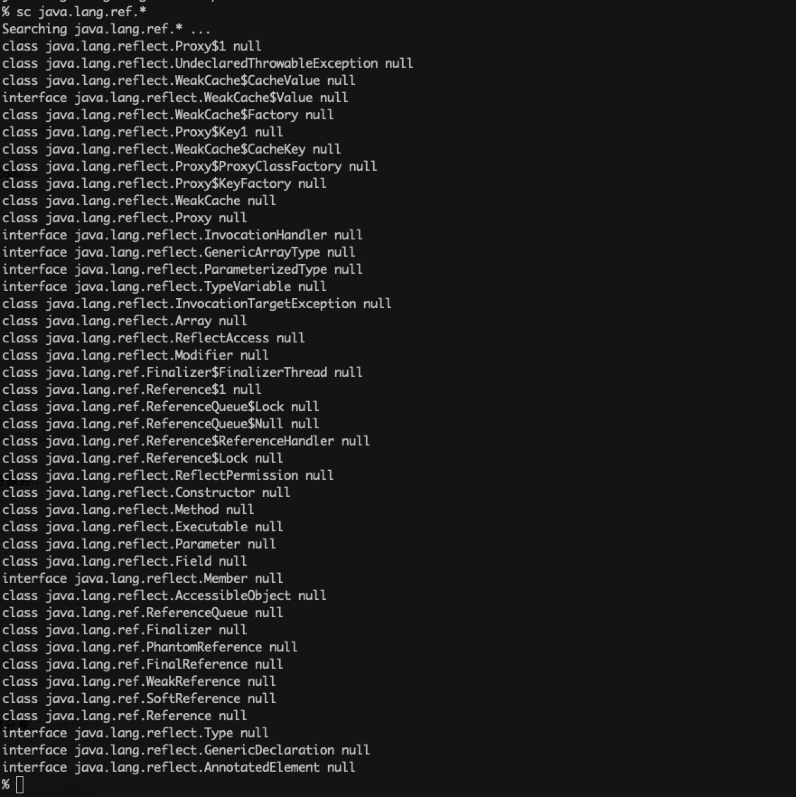
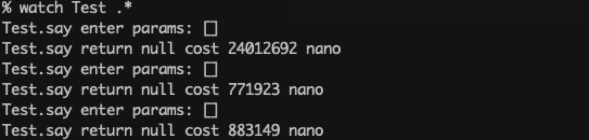
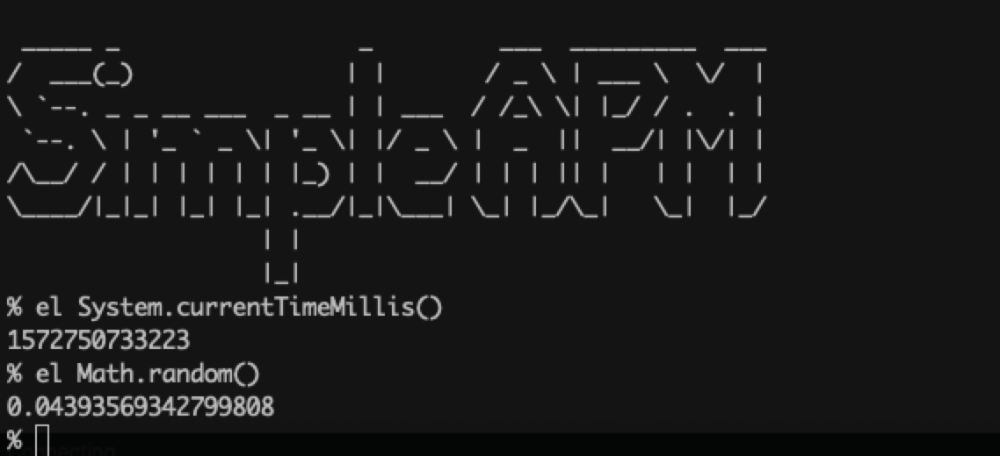
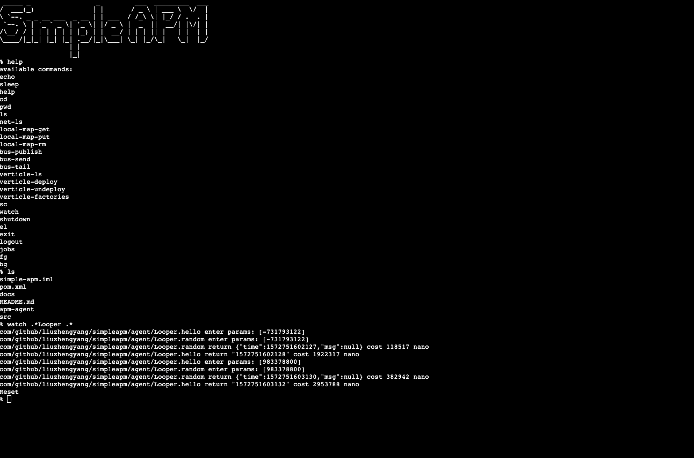

# simple-apm

实现一个简版的arthas。 

javaagent运行时attach到目标进程，通过netty启动一个rpc接口，接收命令，如果是监控方法耗时、参数、返回值的watch命令，
则创建一个ClassFileTransformer, 通过ASM修改对应的类，在方法前后注入代码，调用Instrumentation.retransform方法完成增强。

# Quick Start

release中下载boot.jar和agent.jar
```
java -Xbootclasspath/a:${机器上tools.jar位置} -jar apm-boot-1.0-SNAPSHOT-jar-with-dependencies.jar apm-agent-1.0-SNAPSHOT-jar-with-dependencies.jar的全路径位置 目标进程id
```
启动完成后，可以访问http://localhost:5000/shell.html 或者 `telnet localhost 6000`进行访问

## Commands

目前实现的方法有

### sc

Search Class



### watch

观察方法的参数、返回值、耗时


### el

执行表达式


### dump

dump一个class到本地class文件

```
dump xxxx.class
```

### websocket

支持websocket链接，并且提供了一个默认的websocket页面

